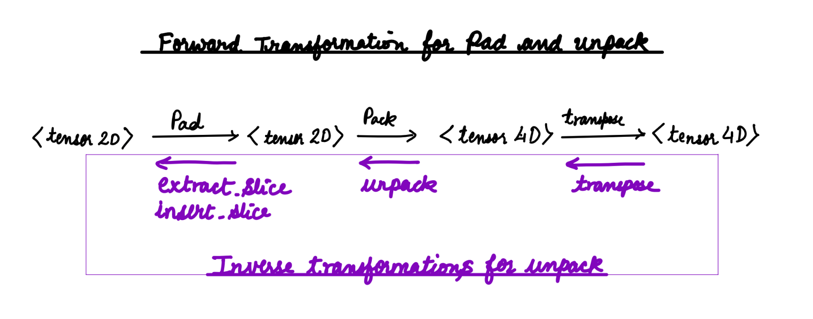

# IREE CPU/GPU Packing and Padding Transformation

## Definitions

- Pad     : Pads the data in memory to align for tiling and/or vecotrized access.
- Pack    : Packs the data in memory to allow more efficient memory access pattern. Packing operation physically rearranges the data in memory.
- Unpack  : Unpack operation is the inverse of pack operation and gets the data in memory in its original form.
- Reshape : Changes the logical view of the data from source shape to the destination shae. The reshape does *not* physically rearranges the data in memory.

### Consider the following IR

```mlir
func.func @pad_and_pack(%arg0: tensor<13x15xf32>, %arg1: tensor<2x8x8x2xf32>, %arg2: f32) -> tensor<2x8x8x2xf32> {
  %0 = tensor.pack %arg0 padding_value(%arg2 : f32) inner_dims_pos = [0, 1] inner_tiles = [8, 2] into %arg1 : tensor<13x15xf32> -> tensor<2x8x8x2xf32>
  return %0 : tensor<2x8x8x2xf32>
}
```

Listing 1: Take tensor<13x15xf32> pads and packs into tensor<2x8x8x2xf32>

### Input `tensor<13x15xf32>` Logical View and Physical Layout in Memory


### Output `tensor<2x8x8x2xf32>` Logical View and Physical Layout in Memory


### Run `generalize-tensor-pac` on MLIR Listing 1

```bash
./llvm-project/bin/mlir-opt  -split-input-file --test-transform-dialect-interpreter --canonicalize --test-linalg-transform-patterns="test-generalize-tensor-pack" ../iree/third_party/llvm-project/mlir/test/Dialect/Linalg/generalize-tensor-pack-tile.mlir
```

```mlir
// -----
#map = affine_map<(d0) -> (d0 * 8)>
#map1 = affine_map<(d0) -> (d0 * -8 + 13, 8)>
#map2 = affine_map<(d0) -> (d0 * 2)>
#map3 = affine_map<(d0) -> (d0 * -2 + 15, 2)>
#map4 = affine_map<(d0) -> (-d0 + 8)>
#map5 = affine_map<(d0) -> (-d0 + 2)>
module {
  func.func @pad_and_pack(%arg0: tensor<13x15xf32>, %arg1: tensor<2x8x8x2xf32>, %arg2: f32) -> tensor<2x8x8x2xf32> {
    %c8 = arith.constant 8 : index
    %c0 = arith.constant 0 : index
    %c1 = arith.constant 1 : index
    %c2 = arith.constant 2 : index
    %0 = scf.for %arg3 = %c0 to %c2 step %c1 iter_args(%arg4 = %arg1) -> (tensor<2x8x8x2xf32>) {
      %1 = scf.for %arg5 = %c0 to %c8 step %c1 iter_args(%arg6 = %arg4) -> (tensor<2x8x8x2xf32>) {
        %2 = affine.apply #map(%arg3)
        %3 = affine.min #map1(%arg3)
        %4 = affine.apply #map2(%arg5)
        %5 = affine.min #map3(%arg5)
        %extracted_slice = tensor.extract_slice %arg0[%2, %4] [%3, %5] [1, 1] : tensor<13x15xf32> to tensor<?x?xf32>
        %extracted_slice_0 = tensor.extract_slice %arg6[%arg3, %arg5, 0, 0] [1, 1, 8, 2] [1, 1, 1, 1] : tensor<2x8x8x2xf32> to tensor<1x1x8x2xf32>
        %6 = affine.apply #map4(%3)
        %7 = affine.apply #map5(%5)
        %padded = tensor.pad %extracted_slice low[%c0, %c0] high[%6, %7] {
        ^bb0(%arg7: index, %arg8: index):
          tensor.yield %arg2 : f32
        } : tensor<?x?xf32> to tensor<8x2xf32>
        %8 = tensor.empty() : tensor<8x2xf32>
        %transposed = linalg.transpose ins(%padded : tensor<8x2xf32>) outs(%8 : tensor<8x2xf32>) permutation = [0, 1] 
        %inserted_slice = tensor.insert_slice %transposed into %extracted_slice_0[0, 0, 0, 0] [1, 1, 8, 2] [1, 1, 1, 1] : tensor<8x2xf32> into tensor<1x1x8x2xf32>
        %inserted_slice_1 = tensor.insert_slice %inserted_slice into %arg6[%arg3, %arg5, 0, 0] [1, 1, 8, 2] [1, 1, 1, 1] : tensor<1x1x8x2xf32> into tensor<2x8x8x2xf32>
        scf.yield %inserted_slice_1 : tensor<2x8x8x2xf32>
      }
      scf.yield %1 : tensor<2x8x8x2xf32>
    }
    return %0 : tensor<2x8x8x2xf32>
  }
  transform.sequence  failures(propagate) {
  ^bb0(%arg0: !pdl.operation):
    %0 = transform.structured.match ops{["tensor.pack"]} in %arg0 : (!pdl.operation) -> !pdl.operation
    %tiled_linalg_op, %loops:2 = transform.structured.tile_to_scf_for %0[1, 1]
  }
}
```

## Typical Packing and Padding Transformation Flow


